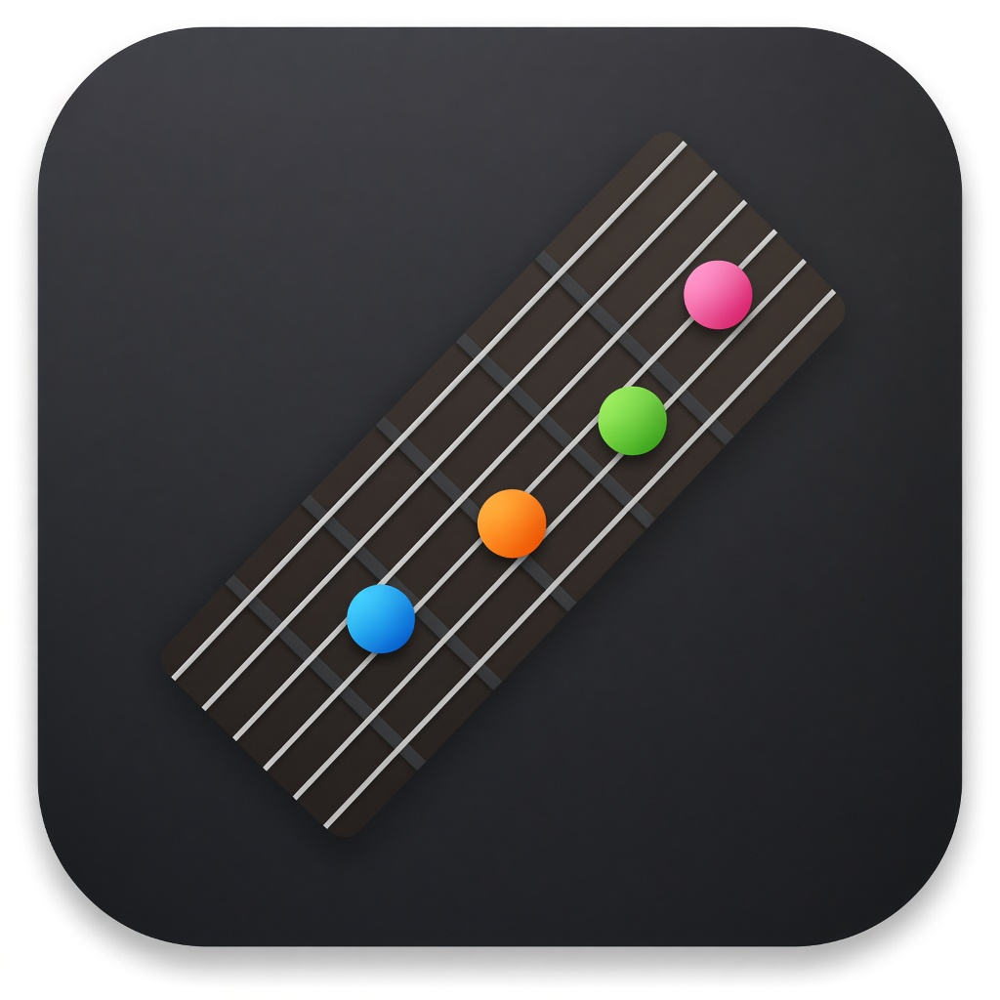
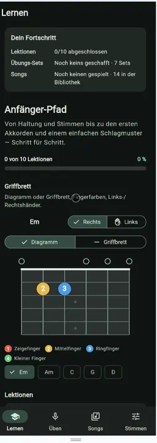
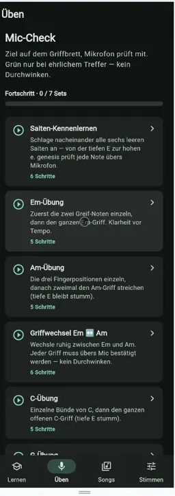
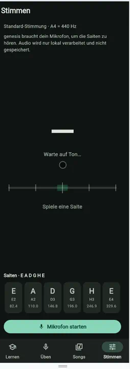
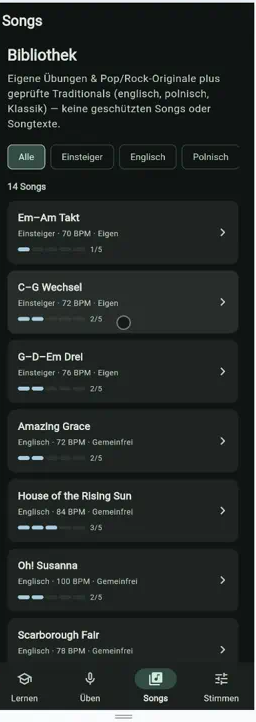
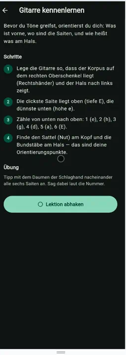
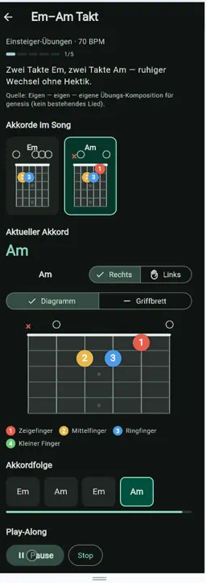
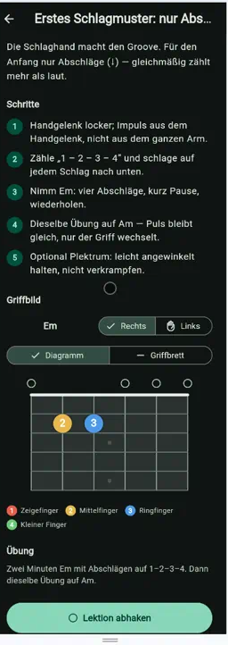
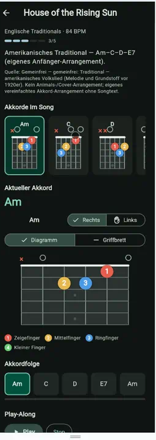

<p align="center">
  
</p>

<h1 align="center">genesis</h1>

<p align="center">
  Gitarren-Lern-App für Anfänger — Lektionen, Mic-Check, Songs, Tuner.<br>
  Flutter, Dark Theme, alles lokal. Kein Account, keine Cloud.
</p>

<p align="center">
  <a href="docs/release/genesis-gitarre-release.apk"><strong>Android-APK laden</strong></a>
  ·
  <a href="mailto:contact@michal-galas.de">contact@michal-galas.de</a>
</p>

## Screenshots

<p align="center">
  
  
  
  
</p>

<p align="center">
  
  
  
  
</p>

| Tab | Inhalt |
|---|---|
| **Lernen** | 10 Anfänger-Lektionen, Fortschritt lokal |
| **Üben** | Sets mit Live-Mikrofon-Check (Pitch) |
| **Songs** | Bibliothek inkl. Play-Along |
| **Stimmen** | Tuner, YIN in reinem Dart |

Griffbrett mit Chord-Shapes, Fingerfarben, Links-/Rechtshänder. Schlag- und Zupfmuster mit Validierung.

## Stack

- Flutter / Dart
- `record` + `permission_handler` für Audio
- `shared_preferences` für Fortschritt
- Pitch: YIN (de Cheveigné & Kawahara) — lokal, ohne Cloud

## Start

```bash
flutter pub get
flutter run -d chrome   # oder linux / Gerät
```

```bash
flutter analyze
flutter test
flutter build web --release
```

## Android-APK

Demo-Build, debug-signiert, kein Play Store:

[docs/release/genesis-gitarre-release.apk](docs/release/genesis-gitarre-release.apk)

```bash
adb install -r docs/release/genesis-gitarre-release.apk
```

## Struktur

```
lib/
  screens/     Lernen, Üben, Songs, Stimmen
  src/pitch/   YIN-Detector
  src/tuner/   Pipeline, Stimmungen
  src/fretboard/
  src/practice/
  src/songs/
  src/strumming/
  src/tutorial/
```

Lernpfad bis Technik-Anleitung ist drin. Kein Store-Release — Portfolio-/Demo-Stand.

## Lizenz

Portfolio. Nutzung: [contact@michal-galas.de](mailto:contact@michal-galas.de)
