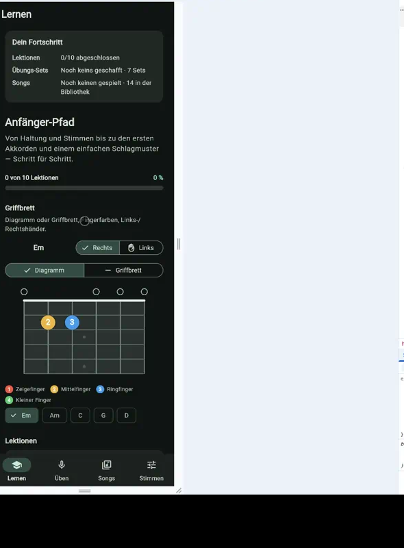
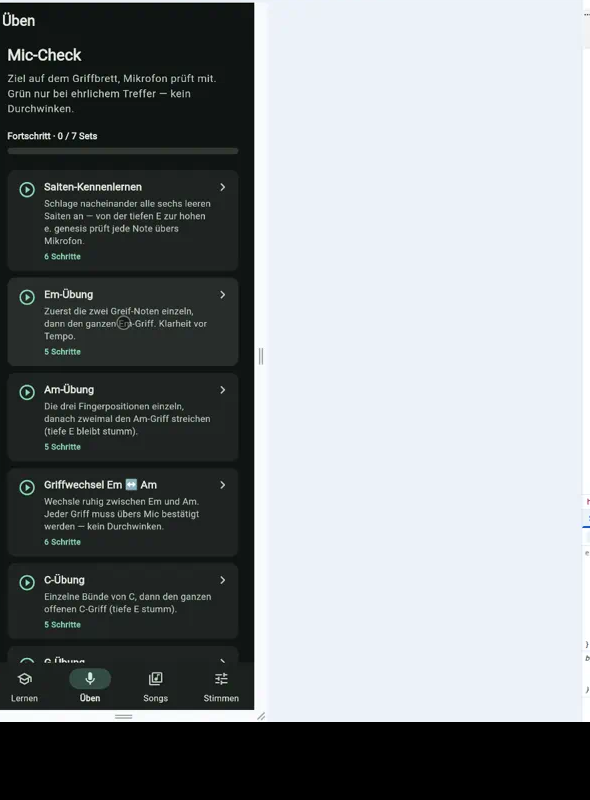
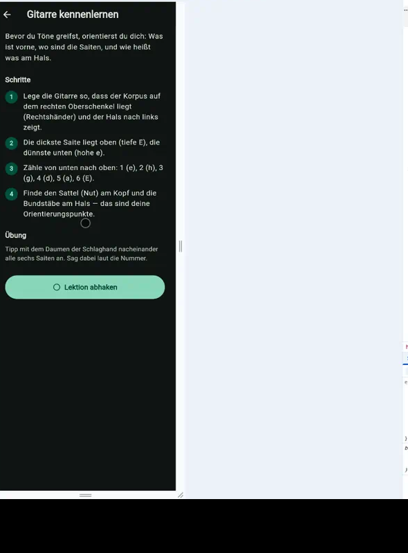
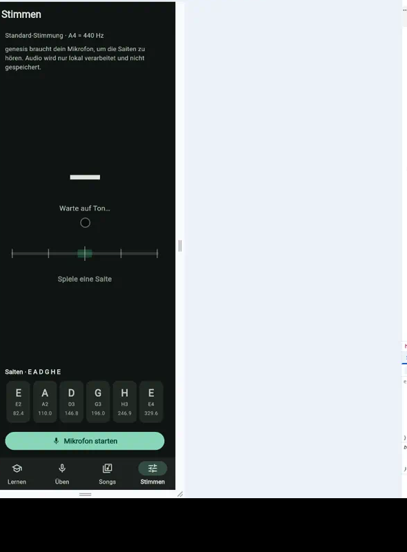
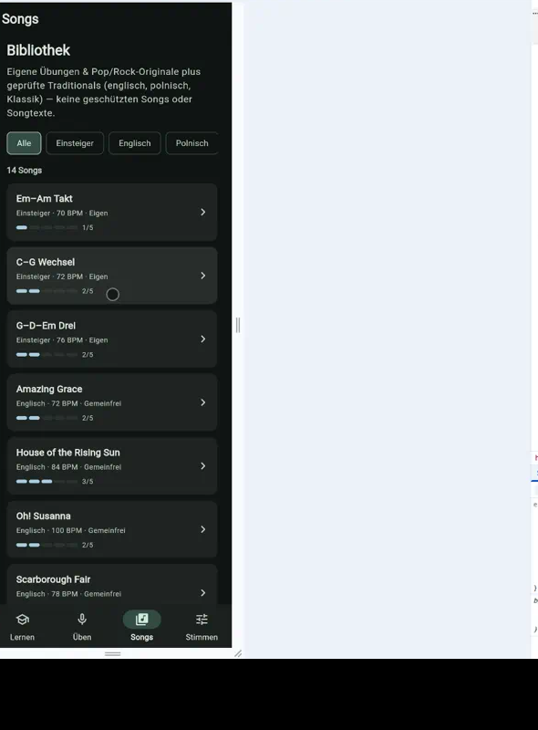
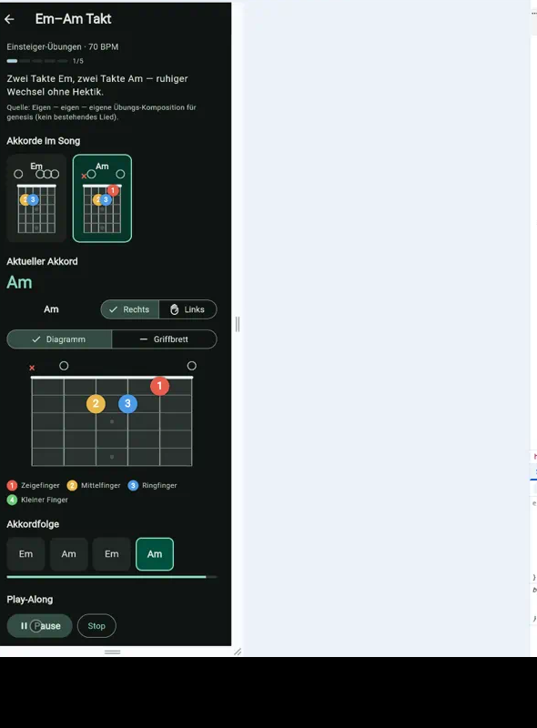
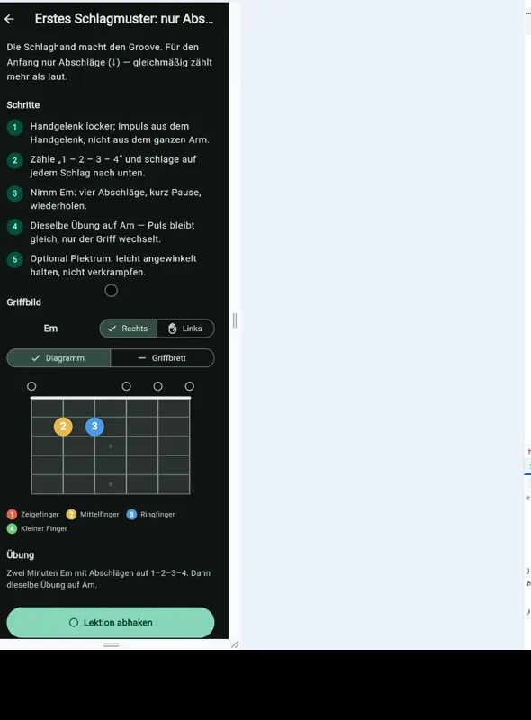
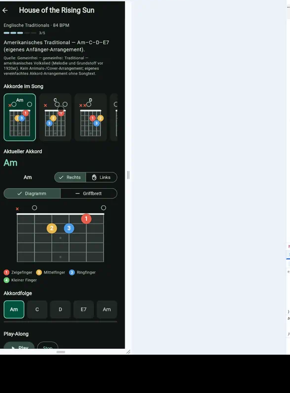

# genesis — Gitarren-Lern-App

Flutter-App für Anfänger: Lernen, Üben mit Mikrofon-Check, Songs und eingebauter Tuner. Mobile-first, Dark Theme (Material 3).


## Features

| Bereich | Was drin ist |
|---|---|
| **Lernen** | 10 eigene Anfänger-Lektionen, Fortschritt lokal gespeichert |
| **Üben** | Übungssets mit Live-Mikrofon-Check (Pitch) |
| **Songs** | Songbibliothek inkl. Play-Along |
| **Stimmen** | Tuner mit YIN-Pitch-Detector in reinem Dart |
| **Griffbrett** | Chord-Shapes, Fingerfarben, Links-/Rechtshänder |
| **Technik** | Schlag- und Zupfmuster mit Validierung |

## Stack

- Flutter / Dart (stable)
- `record` + `permission_handler` für Audio
- `shared_preferences` für Fortschritt
- Pitch: YIN (de Cheveigné & Kawahara), lokal ohne Cloud

## Start

```bash
flutter pub get
flutter run -d chrome   # oder linux / Gerät
```

Checks:

```bash
flutter analyze
flutter test
flutter build web --release
```

## Struktur

```
lib/
  main.dart / app.dart / theme.dart
  screens/          # Lernen, Üben, Songs, Stimmen, …
  src/
    pitch/          # YIN-Detector
    tuner/          # Pipeline, Stimmungen
    fretboard/      # Widget + Painter
    practice/       # Sets, Checker, Progress
    songs/          # Library, Play-Along
    strumming/      # Schlag-/Zupftechnik
    tutorial/       # Lektionen
```

## Status

Lernpfad, Üben, Songs, Stimmen und Technik-Anleitung sind umgesetzt (P0–P6). Kein Store-Release in diesem Repo — Lern-/Demo-Stand.

## Screenshots

| Lernen | Üben |
|---|---|
|  |  |
| **Lektion** | **Stimmen** |
|  |  |
| **Songs** | **Play-Along** |
|  |  |
| **Schlagtechnik** | **Schlagmuster** |
|  |  |

Weitere: [`docs/screenshots/`](docs/screenshots/)

## Android-APK

Demo-Build (debug-signiert, kein Play Store):

[docs/release/genesis-gitarre-release.apk](docs/release/genesis-gitarre-release.apk)

```bash
adb install -r docs/release/genesis-gitarre-release.apk
```

## Lizenz

Privat / Portfolio — bei Interesse an Nutzung: [contact@michal-galas.de](mailto:contact@michal-galas.de)
